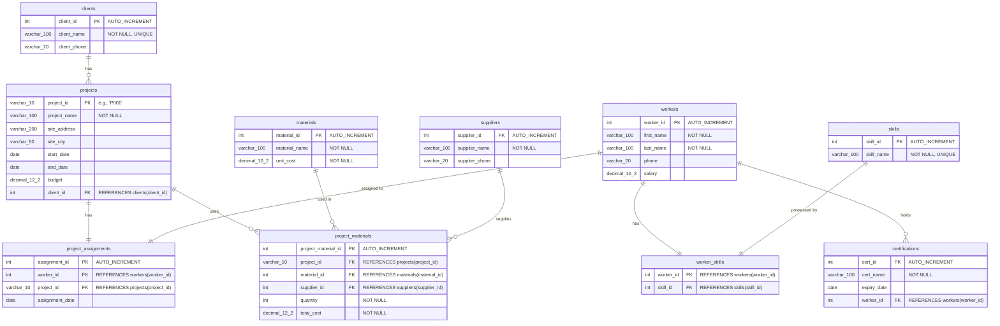

[](https://classroom.github.com/a/vl7bU5KX)
[](https://classroom.github.com/open-in-codespaces?assignment_repo_id=22802523)

[Task Sheet](https://docs.google.com/spreadsheets/d/1wUUJWt1ODAVThNjrU_eBNUIcR20hVv4NkppdPitfEaY/edit?usp=sharing)

# Big3 Construction: Phase 2 - Optimizing & Automating Operations

## Project Overview

**Scenario:** Big3 Construction was thrilled with the normalized 5NF database your team delivered in the Design Activity. The data is clean, redundant-free, and an order of magnitude more reliable.

Now that they've been using it for a few months, they've come back to you with a new set of "Phase 2" requirements. They don't just want to store data; they want to optimize performance, simplify access for different user roles, and automate common business processes.

Your team has been retained to implement these advanced features.

**Total Points:** 200 points  
**Team Size:** 3 members (this is a pair programming assignment) 

## Learning Objectives

By completing this project, you will:

- Analyze query performance and create **Indexes** to optimize data retrieval.
- Write complex, multi-level **Subqueries** and advanced **JOINs** to answer sophisticated business questions.
- Implement **Views** to simplify data access and enhance security.
- Create **Stored Procedures** to encapsulate and automate repetitive, multi-step business logic.
- Enforce complex business rules and maintain data integrity using **Triggers**.
- Schedule automated, recurring database tasks using **Events**.

## Phase 1 Standard Schema

To ensure all teams are working from a consistent, normalized database, this Phase 2 assignment is based on the following official 5NF schema.

Your Phase 1 implementation (your `01_create_tables.sql` and `02_insert_data.sql` scripts) must match this structure. All modules in this assignment assume your table and column names match this ERD.



## Project Setup & Delivery

This assignment builds directly on your "Phase 1" implementation. You will use the `big3_construction` database you built and populated according to the standard schema provided above.

- **GitHub Classroom:** Accept the "Phase 2" assignment from the link on Canvas. This will create a new repository for your team, pre-populated with a folder structure and this README.md.
- **Viewing the Schema Diagram:** To view the Mermaid ERD diagram in this README within VS Code:
  1. Open the Extensions panel (`Ctrl+Shift+X` or `Cmd+Shift+X` on Mac)
  2. Search for "Markdown Preview Mermaid Support"
  3. Install the extension by Matt Bierner
  4. Open this README.md and press `Ctrl+Shift+V` (or `Cmd+Shift+V` on Mac) to open the Markdown preview
  5. The Entity-Relationship Diagram will now render visually
  
  *Note: The diagram also renders automatically when you view this README on GitHub.com*
- **Tools:** We recommend DataGrip as its database management features are excellent for this task. You can manage your scripts, run queries, and easily inspect your database objects (like views, procedures, and triggers) from the UI. However, you may use any tool you are comfortable with (MySQL Workbench, DBeaver, etc.).
- **Collaboration:** This is a pair programming assignment. We highly recommend you work on the logic for the "Challenge" sections together, either in person or over a screen share.

## Submission Requirements

You will submit your work by committing your SQL files to your GitHub Classroom repository. Your repository must contain the following files:

- `01_indexes.sql`: All SQL for Module 1.
- `02_subqueries.sql`: All SQL queries for Module 2.
- `03_views.sql`: All SQL for Module 3.
- `04_procedures.sql`: All SQL for Module 4.
- `05_triggers.sql`: All SQL for Module 5.
- `06_events.sql`: All SQL for Module 6.
- `README.md`: You must edit this file to add your justifications for the "Challenge" sections and a brief Team Contribution Statement at the end.


## Assignment Modules

Follow each module in order. Each one contains a Client Request, a Guided Activity to learn the concept, and a Challenge Task to apply your knowledge.

### [Module 1: Indexes (The "Need for Speed")](module-1/README.md)

### [Module 2: Subqueries & Advanced Joins (The "Complex Questions")](module-2/README.md)

### [Module 3: Views (The "Simple & Secure" Reports)](module-3/README.md)

### [Module 4: Stored Procedures (The "One-Click" Tasks)](module-4/README.md)

### [Module 5: Triggers (The "Automatic Rule-Enforcer")](module-5/README.md)

### [Module 6: Events (The "Scheduled Maintenance")](module-6/README.md)

## Resources & Support

### Official Documentation

- **MySQL Reference Manual:** [https://dev.mysql.com/doc/refman/8.0/en/](https://dev.mysql.com/doc/refman/8.0/en/)
  - Indexes: [https://dev.mysql.com/doc/refman/8.0/en/optimization-indexes.html](https://dev.mysql.com/doc/refman/8.0/en/optimization-indexes.html)
  - Subqueries: [https://dev.mysql.com/doc/refman/8.0/en/subqueries.html](https://dev.mysql.com/doc/refman/8.0/en/subqueries.html)
  - Views: [https://dev.mysql.com/doc/refman/8.0/en/views.html](https://dev.mysql.com/doc/refman/8.0/en/views.html)
  - Stored Procedures: [https://dev.mysql.com/doc/refman/8.0/en/stored-routines.html](https://dev.mysql.com/doc/refman/8.0/en/stored-routines.html)
  - Triggers: [https://dev.mysql.com/doc/refman/8.0/en/triggers.html](https://dev.mysql.com/doc/refman/8.0/en/triggers.html)
  - Events: [https://dev.mysql.com/doc/refman/8.0/en/events.html](https://dev.mysql.com/doc/refman/8.0/en/events.html)

### Getting Help

- **Office Hours:** Check Canvas for your instructor's availability
- **Discussion Forum:** Use the Canvas discussion board to ask questions and help your peers
- **Team Communication:** Establish regular check-ins with your team members
- **Debugging Tips:**
  - Use `EXPLAIN` to analyze query performance
  - Test each database object individually before combining them
  - Check error logs if stored procedures, triggers, or events fail
  - Use `SHOW WARNINGS;` to identify issues with your SQL statements

### Recommended Practices

- Commit your work frequently to GitHub with descriptive commit messages
- Test all SQL scripts in a development environment before finalizing
- Document your reasoning for design decisions, especially in challenge sections
- Review each other's code within your team before submission
- Keep a log of issues encountered and how you resolved them

## AI Usage Policy

### Permitted Uses

This assignment is designed to help you develop practical database administration skills that you will use in your professional career. You may use AI tools (such as GitHub Copilot, ChatGPT, or similar) in the following ways:

- **Syntax assistance:** Getting help with SQL syntax, function parameters, or command structure
- **Debugging support:** Understanding error messages and identifying potential issues in your code
- **Concept clarification:** Asking for explanations of database concepts covered in the modules
- **Code review:** Having AI review your code for potential improvements or best practices
- **Documentation:** Generating comments or documentation for your completed code

### Required Practices

When using AI tools, you must:

1. **Understand every line of code:** You are responsible for understanding and being able to explain all code you submit, regardless of its source
2. **Adapt and customize:** Do not submit AI-generated code without reviewing, testing, and adapting it to the specific requirements of Big3 Construction
3. **Document AI usage:** In your Team Contribution Statement, acknowledge when AI tools were used and how they assisted your work
4. **Verify correctness:** AI-generated solutions may contain errors or inefficiencies. Test thoroughly and validate against the assignment requirements

### Prohibited Uses

The following uses of AI are not permitted:

- Submitting entire modules or solutions generated by AI without understanding or modification
- Using AI to complete the assignment without genuine engagement with the learning objectives
- Copying AI-generated code that you cannot explain or defend during discussions
- Relying solely on AI instead of consulting official documentation and course materials

### Academic Integrity

Remember that the goal of this assignment is to develop your skills and understanding. While AI can be a valuable tool, it should enhance your learning, not replace it. You will be expected to discuss and defend your design decisions in team presentations or individual assessments. Work that demonstrates a lack of understanding or engagement with the material may be subject to academic integrity review.

If you have questions about appropriate AI usage for specific situations, consult with me before proceeding.

## Final Deliverable Check

- ☑ `01_indexes.sql`
- ☑ `02_subqueries.sql`
- ☑ `03_views.sql`
- ☑ `04_procedures.sql`
- ☑ `05_triggers.sql`
- ☑ `06_events.sql`
- ☑ `README.md` is updated with all challenge justifications and the Team Contribution Statement.
- ☑ All SQL is well-commented and runnable.

---

## Challenge Justifications

### Module 1 Challenge — Composite Index Column Order Justification

For the query `SELECT * FROM projects WHERE site_city = 'Boston' ORDER BY start_date`, we created:

```sql
CREATE INDEX idx_project_city_startdate ON projects(site_city, start_date);
```

**Why `site_city` first, then `start_date`?**

MySQL (InnoDB) B-Tree indexes work left-to-right. The optimizer can only use the leftmost prefix of a composite index for range filtering. Since `site_city` appears in the `WHERE` clause as an **equality filter**, placing it first allows the engine to jump directly to the subset of rows for that city. Within that narrowed set, `start_date` is already pre-sorted by the index, so no extra sort operation is needed for the `ORDER BY`.

If we had put `start_date` first, the index would be ordered by date across *all* cities. A filter on `site_city` would then require scanning large portions of the index, removing the benefit. The rule of thumb is: **equality columns before range/sort columns**.

The `EXPLAIN` output after index creation should show:
- `type: ref` (not `ALL`)
- `key: idx_project_city_startdate`
- `Extra: Using index condition` (possibly `Using where`), but crucially **no** `Using filesort`

---

### Module 2 Challenge — "Max of a Count" Query Design

To find the project(s) with the highest worker count (handling ties), we used a **derived table (subquery in FROM)** combined with a **scalar subquery in WHERE**:

```sql
SELECT p.project_name, worker_counts.worker_count
FROM projects p
JOIN (
    SELECT project_id, COUNT(worker_id) AS worker_count
    FROM project_assignments
    GROUP BY project_id
) AS worker_counts ON p.project_id = worker_counts.project_id
WHERE worker_counts.worker_count = (
    SELECT MAX(cnt)
    FROM (
        SELECT COUNT(worker_id) AS cnt
        FROM project_assignments
        GROUP BY project_id
    ) AS all_counts
);
```

We couldn't just use `HAVING COUNT(*) = MAX(COUNT(*))` because MySQL doesn't allow nested aggregate functions directly in HAVING. The two-level approach is the right way to handle it. The inner derived table counts workers per project, the outer scalar subquery finds the maximum of those counts, and the main query filters to only show projects that match. It also handles ties correctly — using LIMIT 1 would've cut off any projects that tied for the top spot.

---

### Module 3 Challenge — Financial Summary View Design Decisions

```sql
CREATE OR REPLACE VIEW v_project_financial_summary AS
SELECT
    p.project_name,
    c.client_name,
    p.budget AS project_budget,
    COALESCE(SUM(pm.total_cost), 0) AS total_materials_cost,
    p.budget - COALESCE(SUM(pm.total_cost), 0) AS remaining_budget
FROM projects p
JOIN clients c ON p.client_id = c.client_id
LEFT JOIN project_materials pm ON p.project_id = pm.project_id
GROUP BY p.project_id, p.project_name, c.client_name, p.budget;
```

A few things we had to think through here:

We used LEFT JOIN on `project_materials` instead of a regular JOIN because some projects might not have any material costs recorded yet. With an INNER JOIN those projects would just drop off the view completely, which would be misleading for the accounting team. LEFT JOIN keeps every project in the results no matter what.

The COALESCE is there because when a project has no materials, SUM returns NULL, and then `budget - NULL` also gives NULL. So `remaining_budget` would be blank for those projects. COALESCE converts the NULL to 0 so the subtraction always gives a sensible number.

We also put `p.project_id` in the GROUP BY even though it's not in the SELECT list. MySQL strict mode requires every non-aggregated column to either be in the SELECT or the GROUP BY. Including the primary key also protects against edge cases where two projects might share the same name.

---
# Module 4 Challenge – Stored Procedures

## Part 4A: sp_add_worker_with_skill

This procedure handles adding a new worker and their primary skill in one call. It inserts the worker, grabs the new ID using `LAST_INSERT_ID()`, looks up the skill ID, and only inserts into `worker_skills` if the skill actually exists. Everything runs inside a transaction so both inserts either succeed together or not at all.

**Test:**
```sql
CALL sp_add_worker_with_skill('Alice', 'Smith', '555-1234', 75000.00, 'Project Management');
```
Checked the `workers` and `worker_skills` tables after — Alice was added and her skill was linked correctly.

---

## Part 4B: sp_assign_worker_to_project

This procedure assigns a worker to a project but first checks if that assignment already exists. It uses `COUNT(*)` to detect duplicates and returns a message through an `OUT` parameter instead of throwing an error.

**Test 1 – New assignment (should succeed):**
```sql
CALL sp_assign_worker_to_project(1, 'P001', @message);
SELECT @message;
-- Output: 'Success: Worker assigned.'
```

**Test 2 – Duplicate assignment (should return error message):**
```sql
CALL sp_assign_worker_to_project(1, 'P001', @message);
SELECT @message;
-- Output: 'Error: Worker already assigned to this project.'
```

Both tests worked as expected.

### Module 5 Challenge — Testing the BEFORE INSERT Safety Trigger

The trigger `trg_validate_safety_cert_before_insert` fires before any new row is inserted into `project_assignments`. Here is how we tested it:

First, we manually expired a worker's Basic Safety cert:
```sql
UPDATE certifications SET expiry_date = '2020-01-01'
WHERE worker_id = 2 AND certification_name = 'Basic Safety';
```

Then tried to assign that worker to a project:
```sql
INSERT INTO project_assignments(worker_id, project_id, assignment_date)
VALUES (2, 'P004', CURDATE());
```

That threw: `Error: Worker safety certification is expired or missing.` and blocked the insert, which is exactly what we wanted.

We also tested the missing cert case by deleting the row entirely and trying again — the trigger blocked it there too, since the SELECT returns NULL and the IF condition catches NULL the same way it catches an expired date.

Finally we set the expiry to a future date and confirmed the insert went through without errors.

---
### Module 6: Events (The "Scheduled Maintenance") Challenge

To test the event without waiting a month, temporarily change the schedule to `AT CURRENT_TIMESTAMP + INTERVAL 5 SECOND` so it fires almost immediately. After a few seconds, check that rows with `end_date` older than 5 years moved from `projects` into `archived_projects` and were removed from `projects`. Once confirmed, recreate the event with the correct `EVERY 1 MONTH` schedule. Alternatively, disable the event with `ALTER EVENT ev_archive_old_projects DISABLE` and run the INSERT and DELETE statements manually as a plain SQL script to verify which rows are affected before touching the live data.

## Team Contribution Statement

| Team Member | What they worked on |
|-------------|---------------------|
| Olubanjo Kolapo | Module 1 (Indexes) — EXPLAIN analysis, simple last_name index, composite city/date index. Module 2 (Subqueries) — both skill lookup queries and max worker count challenge. Module 3 (Views) — supervisor view and financial summary view. |
| John Obure | Module 4 (Stored Procedures) — guided `sp_add_worker_with_skill` procedure and challenge `sp_assign_worker_to_project` procedure. |
| Hephzibah Ofomi | Module 5 (Triggers) — audit log table, budget audit trigger, safety cert BEFORE INSERT trigger, and trigger testing. |
| Paul Rwagasana | Module 6 (Events) — archive table, archival event with transaction logic, and event scheduler setup. |

We worked through the trickier parts together, especially the challenge queries and the trigger logic. All scripts were run and checked locally before we finalised them.
